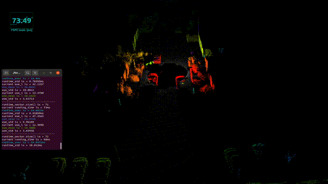

## Fast range image based DBSCAN clustering for 3D LiDAR Point Clouds
An ROS implementation of dbscan clustering of 3D LiDAR point clouds

## Reference
* Chen, Zhihui, et al. "Fast-spherical-projection-based point cloud clustering algorithm." Transportation research record 2676.6 (2022): 315-329.

## Features
* Faster comparing to traditional dbscan algorithm

**TODOs**
* imporove the segmentation accuracy 

## Dependencies
* semantic_kitti_loader
* obsdet_msgs

## How to use
    # clone the repo
    mkdir -p catkin_ws/src
    cd catkin_ws/src
    git clone https://github.com/HMX2013/SemanticKITTI_loader
    git clone https://github.com/HMX2013/FSPC-ROS

    cd ../
    catkin_make

    roslaunch ri_dbscan run_rviz.launch
    roslaunch semantic_kitti run_semantic.launch

## Contribution
You are welcome contributing to the package by opening a pull-request

We are following: 
[Google C++ Style Guide](https://google.github.io/styleguide/cppguide.html), 
[C++ Core Guidelines](https://isocpp.github.io/CppCoreGuidelines/CppCoreGuidelines#main), 
and [ROS C++ Style Guide](http://wiki.ros.org/CppStyleGuide)

## License
MIT License
